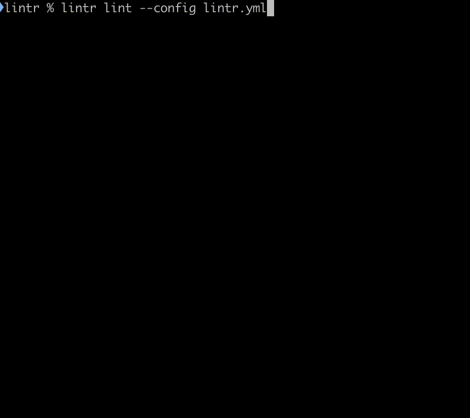

## Lintr

A powerful and flexible GitHub repository settings linter, written in pure Python.

<center>
  
</center>

## Highlights

- ✅ Enforces consistent GitHub repository settings.
- 🔒 Monitors key repository settings against [predefined rules](#rules) and [rule sets](#rule-sets).
- 🛡️ Helps mitigate security issues.
- ⚙️ Streamlines repository management.
- 🤖 Automates checks for repository hygiene.

## Installation

Lintr is available as `lintr` on [PyPI](https://pypi.org/project/lintr/).

Lintr can be invoked directly with [uvx](https://docs.astral.sh/uv/):

```bash
uvx lintr --help   # List command line reference.
uvx lintr lint     # Lint repository settings
```

Or installed with `uv` (recommended), `pip`, or `pipx`:




```bash
# Using pip.
pip install lintr
```


```bash
# Using pipx.
pipx install lintr
```


```bash
# Using uv.
uv install lintr
```



Once installed, you can run Lintr from the command line: 

```bash
lintr help   # List command line reference.
lintr lint   # Lint repository settings
```

Since Lintr is installed as the Python module `lintr`, you can also run Lintr through the Python interpreter:

```bash
python -m lintr help   # List command line reference.
python -m lintr lint   # Lint repository settings
```

Then, check out the [first steps]() or read on for a brief overview.

## Personal Access Token

Lintr needs a [personal access token](https://docs.github.com/authentication/keeping-your-account-and-data-secure/managing-your-personal-access-tokens) 
to access the GitHub API on your behalf.

It is recommended to generate a dedicated access token for use with Linter to ensure that it runs with the most restrictive privileges possible.

If you are using a [Fine-grained token](https://docs.github.com/en/authentication/keeping-your-account-and-data-secure/managing-your-personal-access-tokens#creating-a-fine-grained-personal-access-token),
make sure it has the following repository permissions:
- __Read access to metadata__, and either
- __Read access to administration__, or
- __Read and Write access to administration__.

Write access to administration is required if Lintr should make changes to repository settings to fix rule violations.

If you are using a [personal access token (classic)](https://docs.github.com/en/authentication/keeping-your-account-and-data-secure/managing-your-personal-access-tokens#creating-a-fine-grained-personal-access-token), ensure `repo` and optionally `public_repo` are 
ticked.

Once you have retrieved the personal access token, make it available to Lintr by setting the environment variable `GITHUB_TOKEN`:
```bash
set GITHUB_TOKEN="your-token-here"
```

{}
You can also set the token in a [configuration file](), but it is recommended to use an environment variable to ensure the token is not stored on disk in plain text and/or mixed with other configuration that might want to commit to version control or share with others.
{}

Once you have configured the token, you can verify it:
```bash
lintr lint
```

This will enumerate all repositories that can be accessed with the token. By default, Lintr uses an empty rule set for each repository, so no actual linting will be performed.

## Configuration file

By default, Lintr will scan all repositories it has access to through the personal access token, but will not apply any checks. To configure Linter, it is recommended
to create a YAML-formatted configuration file, e.g. `lintr.yml`. Using a configuration file allows to configure the linting process, including the repositories to lint
and the rule sets to use. Check the [configuration file reference]() for more detailed information.

Here is an example of a simple `lintr.yml` file:

```yaml
# The default rule set to use.
default_ruleset: standard

rulesets:
  standard:  # Identifier must be unique across rules and rulesets.
    name: "standard"
    rules:  # List of rules and rulesets to include.
      - "R001"
      - "R002"
      - "R003"
```

This defines a new ruleset named `standard` and makes it the default for all repositories. It uses pre-defined rules that come with Lintr.

Once created, you can use Lintr with the configuration file as follows:

```bash
lintr lint --config lintr.yml
```

This will lint all repositories using the `standard` ruleset defined in the configuration file and report any violations.

## Features

### Command-line Interface (CLI)

Operate Lintr effortlessly through its CLI. Lint all your repositories, or list available rules and rule sets, every task can be performed with simple commands.

### Rules

Lintr comes with a range of pre-defined rules covering a wide range of repository settings. Combine these rules to lint all your repositories or use them as starting point for custom rules.

### Custom rules

Create your custom rules by reconfiguring existing rules. This allows you to tailor Lintr to your specific needs and preferences.

### Rule Sets

Lintr comes with pre-built rule sets covering a wide range of repository configurations, including branch policies, permissions, 
issue settings, and more.

### Automatic Fixes

For many common issues, Lintr not only detects problems but can also automatically apply fixes. This is especially useful in large 
environments where manual interventions might be too time-consuming.

### Customizability

Every project is unique. Configure Lintr with repository-specific rules and settings as needed.

### Detailed Output and Reporting

Get clear and concise feedback about each check, including colorized status symbols and descriptive messages. This clarity helps you 
quickly identify and address any problems.


## Purpose

Lintr was built with the aim of streamlining repository management by automatically **linting** various aspects of a repository’s 
configuration. At its core, the tool monitors key repository settings and compares them against a set of predefined rules – from branch naming conventions to GitHub permission configurations. Here’s why Lintr exists:

### Addressing Inconsistencies
Many organizations face challenges due to inconsistent repository configurations, which can lead to fragmented practices and unexpected security issues. Lintr helps mitigate these issues by ensuring that every repository adheres to the desired guidelines.

### Automation and Efficiency
Manual checks are tedious and error-prone. With Lintr, you can automate the process of verifying repository settings, which not only saves time but also reduces the risk of human error.

### Extensibility
Lintr is designed to be highly extensible. Not only does it come with a set of core rules, but it also allows you to create and register custom rules tailored to your organization’s specific needs.

### Improved Repository Health
By catching configuration deviations early, Lintr helps maintain an overall healthy repository environment. This proactive monitoring can prevent potential security oversights and streamline your development workflow.

## Who Should Use Lintr?

Lintr is aimed primarily at those who manage or contribute to multiple GitHub repositories and wish to enforce a uniform standard across them. Its flexibility and robust feature set make it ideal for:

### Repository Maintainers
Ensure that every repository under your stewardship adheres to consistent configuration standards. Lintr helps catch misconfigurations before they cause issues.

### DevOps Engineers
Integrate Lintr into your CI/CD pipelines to automate the process of repository configuration validation. This guarantees that your deployment environments meet the necessary guidelines.

### Developers Interested in Automation
If you love automation and want your development process to be as robust as possible, Lintr offers automated linting that can save countless hours and reduce manual oversight.
